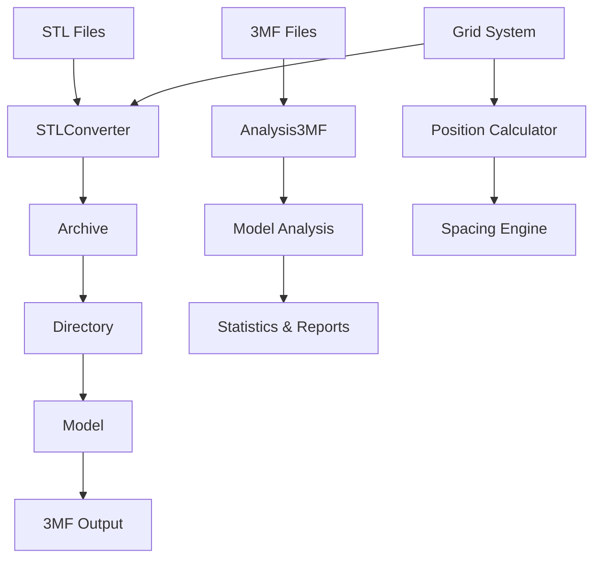

# Noah123d

<div align="center">
  
  <h3>Building assemblies from STL models</h3>
  <p>A comprehensive STL to 3MF converter with advanced grid layout capabilities</p>
</div>

---

## Overview

Noah123d is a powerful Python library and CLI tool for converting STL files to 3MF format with advanced features for 3D printing workflows. It specializes in creating grid layouts, analyzing 3D models, and managing complex assemblies.

## Key features

### 🔄 STL to 3MF conversion
Convert binary and ASCII STL files to industry-standard 3MF format with high performance and accuracy.

### 🔲 grid layout system
Automatically arrange multiple copies of objects in optimized grid patterns with intelligent spacing.

### 🔍 3MF analysis
Analyze existing 3MF files to extract model information, dimensions, and center of mass calculations.

### ⚡ high performance
Process complex models with 80,000+ triangles/second with efficient memory usage.

### 📊 rich metadata
Generate detailed conversion statistics and model information for quality assurance.

## Quick start

### Installation

```bash
pip install noah123d
```

### Basic usage

=== "Simple Conversion"

    ```python
    from noah123d import stl_to_3mf
    
    # Convert single STL to 3MF
    success = stl_to_3mf("model.stl", "output.3mf")
    ```

=== "Grid Layout"

    ```python
    from noah123d import stl_to_3mf_grid
    
    # Create 2x2 grid with 4 copies
    success = stl_to_3mf_grid(
        stl_path="part.stl",
        output_path="grid.3mf",
        count=4,
        grid_cols=2,
        spacing_factor=1.2
    )
    ```

=== "3MF Analysis"

    ```python
    from noah123d import analyze_3mf
    
    # Analyze existing 3MF file
    analysis = analyze_3mf("model.3mf")
    print(f"Objects: {analysis['summary']['object_count']}")
    print(f"Dimensions: {analysis['summary']['overall_dimensions']}")
    ```

## Use cases

### 🏭 production manufacturing
Create optimized print layouts for batch production with consistent spacing and arrangement.

### 🔬 prototyping
Quickly generate test arrays with different configurations and spacing options.

### 📦 assembly kits
Organize multiple components in logical arrangements for packaging and assembly.

### 🔧 3D printing optimization
Maximize print bed utilization with intelligent grid layouts and spacing calculations.

## Performance

- **High-speed conversion**: 80,000+ triangles/second
- **Memory efficient**: Reuses geometry data for multiple copies
- **Scalable**: Handles complex models with hundreds of thousands of triangles
- **Reliable**: Robust error handling and validation

## Architecture

Noah123d is built with a modular architecture:



## Getting started

1. **[Installation](getting-started/installation.md)** - install Noah123d and dependencies
2. **[Quick start](getting-started/quickstart.md)** - basic usage examples
3. **[Grid layouts](user-guide/grid-layouts.md)** - advanced grid configuration
4. **[API reference](reference/index.md)** - complete API documentation

## Examples

Explore practical examples:

- [Simple STL Conversion](examples/simple-conversion.md)
- [Grid Layout Creation](examples/grid-layouts.md)
- [Batch Processing](examples/batch-processing.md)
- [Advanced 3MF Analysis](examples/advanced-usage.md)

## Community

- **GitHub**: [42sol-eu/noah123d](https://github.com/42sol-eu/noah123d)
- **Issues**: [Report bugs or request features](https://github.com/42sol-eu/noah123d/issues)
- **Discussions**: [Community discussions](https://github.com/42sol-eu/noah123d/discussions)

## License

Noah123d is released under the MIT License. See [LICENSE](https://github.com/42sol-eu/noah123d/blob/main/LICENSE) for details.
